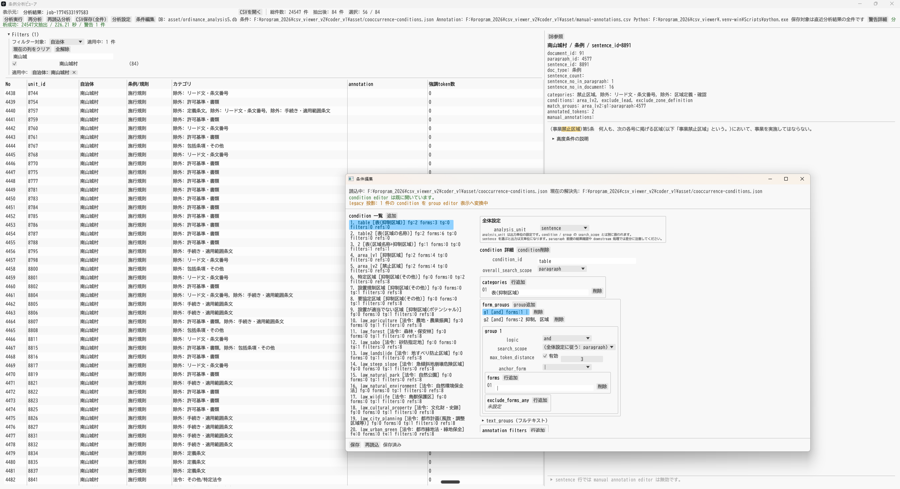

# 条例分析ビューア

Rust + `eframe` / `egui` で構築した、条例・規則テキストの分析結果を確認するためのデスクトップアプリです。  
CSV の閲覧、フィルタリング、Python バックエンドを使った分析実行、条件 JSON の編集、manual annotation の追記を 1 つの UI にまとめています。



## 主な機能

- CSV の読込と一覧表示
- 自治体名、条例/規則、カテゴリなどによる絞り込み
- Python バックエンドによる分析実行
- 条件 JSON の読み込み・保存・編集（条件エディターヘッダーの「選択」で別ファイルを指定可能。分析実行でも同じパスを使用）
- SQLite DB を参照する DB Viewer
- `manual-annotations.csv` への annotation 追記
- 分析結果の全件 CSV エクスポート

## 画面構成

- 上部ツールバー
  CSV の読込、分析実行、再分析、CSV 保存、分析設定、条件編集を操作します。
- 左ペイン
  フィルタ条件と分析結果一覧を表示します。
- 右ペイン
  選択行の詳細、タグ付きテキスト、DB 参照情報を表示します。
- 下部 annotation パネル
  paragraph 行に対して manual annotation を追記できます。
- 条件編集ウィンドウ
  条件 JSON を一覧・詳細の両面から編集します。

## 動作に必要なもの

- Rust ツールチェイン
- Python 3.12 以上
- Python パッケージ
  現在の `pyproject.toml` では `polars` を利用します

Python 実行系は次の順で解決されます。

1. 分析設定で明示指定した Python
2. 環境変数 `CSV_VIEWER_PYTHON`
3. プロジェクト直下の `.venv`
4. `uv run python`
5. `python3` / `python`

## セットアップ

### Rust

```bash
cargo build --workspace
```

### Python

`uv` を使う場合:

```bash
uv sync
```

`venv` を使う場合:

```bash
python -m venv .venv
. .venv/bin/activate
pip install polars
```

Windows PowerShell の例:

```powershell
python -m venv .venv
.venv\Scripts\Activate.ps1
pip install polars
```

## 起動方法

CSV を開かずに起動:

```bash
cargo run
```

CSV パスを指定して起動:

```bash
cargo run -- path/to/input.csv
```

起動後は、必要に応じて上部ツールバーから `CSVを開く`、`分析設定`、`条件編集` を使います。

## 付属サンプル

リポジトリには開発用のサンプル資産が含まれます。

- `asset/ordinance_analysis5.db`
- `asset/cooccurrence-conditions.json`
- `asset/manual-annotations.csv`

これらは既定値として解決されるため、開発環境ではそのまま動作確認に使えます。

## 開発時によく使うコマンド

ビルド:

```bash
cargo build --workspace
```

テスト:

```bash
cargo test
```

IPC DTO 自己検証:

```bash
cargo run -- --ipc-dto-self-check
```

Tauri パイロットの最小フロント起動:

```bash
cargo run -p csv_viewer_tauri_host
```

## ディレクトリ概要

- `src/`
  Rust 側の GUI 本体
- `analysis_backend/`
  Python 側の分析ロジック
- `asset/`
  既定の条件 JSON、annotation CSV、SQLite DB
- `docs/`
  設計メモ、レビュー、補助資料、画面キャプチャ
- `src-tauri/`
  Tauri パイロット用の最小フロント

## 補足

- 現在の開発手順は Windows を強く意識しています。
- GUI の日本語表示は環境フォントに依存します。
- 条件 JSON や annotation CSV の保存先は、分析設定からセッション単位で切り替えられます。
